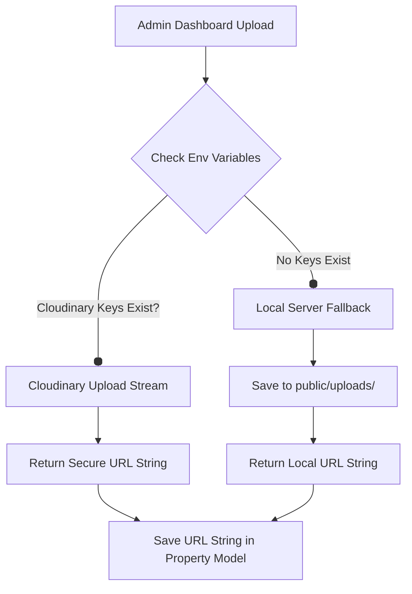

# EUS Realty — Image Storage & Optimization Guide

Real estate portals require high-resolution image rendering to showcase premium projects. Storing image binary payloads or base64 strings directly in a database (like MongoDB) is highly inefficient, limits scalability, and can lead to performance degradation or database size exhaustion. 

This guide details our current integration setup and how to configure optimal cloud hosting providers so that the MongoDB database stores only lightweight URL strings.

---

## 1. Why Store Images Outside the Database?

* **Database Bloat**: Storing raw image files in MongoDB quickly triggers the **16MB document size limit** and causes the database storage cost to climb exponentially.
* **Network Overhead**: Fetching database records with raw image payloads slows API response times down to seconds, killing SEO scores and page speeds.
* **CDN Caching**: Cloud storage providers serve assets directly from Edge networks close to users, leading to near-instantaneous page loads compared to querying a database.

---

## 2. Our Active Implementation Architecture

Our project has a built-in intelligent file upload pipeline inside `src/app/api/upload/route.js`:



---

## 3. Recommended Hosting Providers & Setup

### Option A: Cloudinary (Recommended & Built-in)
Cloudinary automatically compresses, optimizes, and transforms images to WebP/AVIF format based on the browser's viewport.

#### How to configure:
1. Sign up for a free or premium account at [Cloudinary](https://cloudinary.com).
2. Grab your API keys from the Cloudinary Console dashboard.
3. Open `c:\Users\rahul\eusrealty\.env.local` and add these variables:
   ```env
   CLOUDINARY_CLOUD_NAME="your_cloud_name"
   CLOUDINARY_API_KEY="your_api_key"
   CLOUDINARY_API_SECRET="your_api_secret"
   ```
4. Restart the development server. The project's `/api/upload` endpoint will automatically switch from local disk storage to secure Cloudinary cloud streams.

---

### Option B: AWS S3 & CloudFront CDN
Ideal for highly scalable setups or enterprise migrations.

#### Setup Guide:
1. Create an AWS S3 bucket and set CORS policies to allow uploads from your domain.
2. Set up an IAM User with `AmazonS3FullAccess` permission policies.
3. Use the `@aws-sdk/client-s3` package to stream uploads from Next.js.
4. Optionally, front the S3 bucket with an AWS CloudFront distribution to cache images on edge locations globally.

---

### Option C: Vercel Blob
The easiest solution if hosting on the Vercel platform.

#### Setup Guide:
1. Connect your GitHub repository to Vercel.
2. In the Vercel Dashboard, enable the "Blob" storage tab.
3. Use `@vercel/blob` inside `src/app/api/upload/route.js` to upload files in a single function call:
   ```javascript
   import { put } from '@vercel/blob';
   const blob = await put(file.name, file, { access: 'public' });
   return NextResponse.json({ url: blob.url });
   ```

---

## 4. Best Practices for Uploading Properties
* **Image Formats**: Prefer `.webp` or `.avif` over `.png` or `.jpg` to reduce asset size by up to 70%.
* **Dimensions**: Limit upload sizes to maximum width `1920px` (Full HD). Extremely large resolutions (4K/8K) are rarely required for normal grid views.
* **Bulk Uploads**: By storing only URLs in MongoDB, you can easily load hundreds of properties simultaneously without any query delays.
